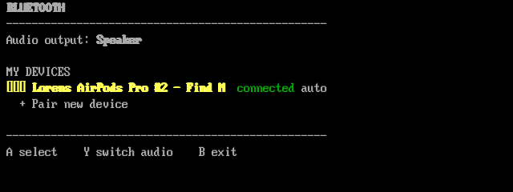
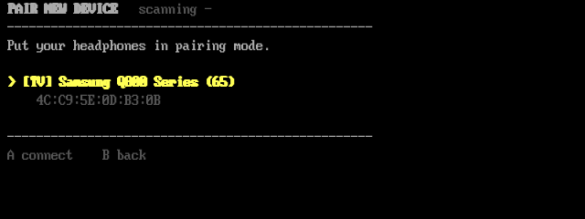

# Bluetooth + USB-C audio for the Anbernic RG35XX SP on muOS

Two things [muOS](https://muos.dev) doesn't do on the RG35XX SP, in one
Archive Manager install:

- **Bluetooth headphones** — a full-screen manager app for pairing, connecting,
  switching audio output, plus auto-reconnect at boot
- **USB-C headphones** — plug-and-play, automatic routing, inline media buttons

Wi-Fi auto-connect and the SP control pack live in their own repos now:
[muos-wifi-autoconnect](https://github.com/lorencouse/muos-wifi-autoconnect),
[muos-rg35xx-sp-controls](https://github.com/lorencouse/muos-rg35xx-sp-controls) —
or get everything at once from
[muos-rg35xx-sp-all-in-one](https://github.com/lorencouse/muos-rg35xx-sp-all-in-one).



## Why this exists

muOS already ships **everything** Bluetooth audio needs on this device — BlueZ,
`rtk_hciattach`, the RTL8821C firmware, PipeWire's bluez5 plugin and codecs —
but disables Bluetooth for the `rg35xx-sp` device profile and never attaches
the adapter, so none of it is reachable. Toggling *Has Bluetooth* in the muOS
settings only reveals a menu entry; there is still no radio behind it and no
management UI at all (muOS 2601 has five screens for Wi-Fi and zero for
Bluetooth).

The actual fix is three commands muOS never runs:

```sh
insmod /lib/modules/4.9.170/kernel/drivers/bluetooth/rtl_btlpm.ko
rtk_hciattach -n -s 115200 /dev/ttyS1 rtk_h5
bluetoothd
```

This project wraps that bringup in a boot hook and adds the missing UI.

## What you get

**Applications → Bluetooth** — a full-screen manager:

- **Pair new device** — live scan, filtered to audio devices (no more pairing
  your neighbour's garage door opener), one press to pair + connect + route audio
- **Device list** with live status: connected, battery % (when the device
  reports it), auto-connect tag
- **Y** — instantly switch audio between the speaker and your headphones
- Per-device **auto-connect at boot** toggle, **disconnect**, **forget**
- Multi-device registry — keep headphones, earbuds and a speaker side by side



Plus a boot hook that brings the adapter up on every boot and reconnects your
last-used auto-connect device, so sound is already in your ears by the time
you're at the launcher.

## Install

1. Download `muOS-BT-USB-Audio-<version>.muxzip` from the
   [latest release](https://github.com/lorencouse/muos-rg35xx-sp-bluetooth/releases/latest).
2. Copy it into the `ARCHIVE` folder on the SD card (over USB, or SFTP /
   the web file manager while on Wi-Fi).
3. On the device: **Applications → Archive Manager**, select the file. It
   installs:
   ```
   MUOS/application/Bluetooth/   the app, helpers, USB-audio kernel modules
   MUOS/init/10-bluetooth.sh     boot hook: Bluetooth + USB-C audio
   ```
4. Enable **Configuration → Advanced Settings → User Init Scripts** so the
   boot hooks run, then reboot.
5. **Applications → Bluetooth** to pair your headphones.

Manual alternative: copy this repo's `MUOS` folder onto the card, merging
with the existing one. Either way it all lives on the SD card, so muOS
updates won't remove it, and it works whether your `MUOS` folder is on SD1
or SD2. Log: `MUOS/log/bluetooth.log` (rotated). To uninstall, delete the
two paths above.

Building the package yourself: `./build.sh` → `dist/*.muxzip`.

## Tested on

- Anbernic **RG35XX SP**, muOS **2601.0 Jacaranda**

Other H700 Anbernic boards muOS supports (RG35XX Plus / 2024 / RG34XX / RG40XX
/ CubeXX) use the same RTL8821CS combo chip and may work unchanged — untested.
Reports welcome.

## USB-C headphones

muOS's kernel omits `CONFIG_SND_USB_AUDIO`, so USB-C audio doesn't work out of
the box — but the kernel *does* auto-switch the OTG port between gadget and
host when it detects a peripheral, and compatible prebuilt kernel modules
exist. This repo bundles the missing modules (`MUOS/application/Bluetooth/modules/`,
built for the stock `4.9.170` kernel — vermagic-identical, loads cleanly) and
the boot hook loads them, so:

1. Plug USB-C headphones (or a USB-C→3.5mm DAC dongle) into the **OTG port**
2. **If nothing happens within ~5 seconds, flip the plug 180°** — role
   detection on this wiring senses only one orientation
3. Audio routes to the headphones automatically within a few seconds
   (`usb-audio-watch.sh`), and back to the speaker when unplugged
4. **Inline media buttons work**: volume up/down drive muOS's own volume
   (on-screen overlay included); play/pause toggles pause in RetroArch
   (`usb-media-buttons.py`)

The port switches back to gadget mode (USB file transfer / adb) by itself
when you plug a computer back in. Do **not** try to switch roles manually via
`/sys/devices/platform/soc/usbc0/otg_role` — that interface deadlocks the
kernel's USB manager on this device (unkillable, needs a power cycle). The
automatic detection is the only working path, and it is enough.

Kernel-update caveat: the `.ko` modules match the stock `4.9.170` kernel. If
a future muOS release ships a different kernel build they will stop loading —
`MUOS/log/bluetooth.log` says so at boot, and Bluetooth is unaffected (its
stack is built into muOS). Rebuild
instructions: [mnml's gist](https://gist.github.com/mnml/12f75bbf16eac4def15ba72cf1b11926)
(vanilla kernel.org 4.9.170 source + Knulli's kernel config + the module
directories `sound/core`, `sound/usb`, `drivers/usb/class`).

## Limitations

- Bluetooth: **SBC/Opus codecs only** (whatever PipeWire ships) — no
  AAC/aptX/LDAC. Fine for games, adequate for music.
- Some devices (AirPods included) don't report battery over standard Bluetooth
  profiles; battery shows only when available.
- Pairing is "just works" only: devices that demand a PIN or on-screen
  confirmation (rare for headphones) can't be paired from this app.
- After a muOS **reflash** the card keeps your device list but BlueZ forgets
  the pairings; the app re-discovers and re-pairs on the next *Connect*
  (put the headphones in pairing mode).
- USB-C: **analog-only USB-C headphones** (passive, no DAC chip) can never
  work — the port has no analog audio mode. Anything that is a real USB audio
  device (almost all USB-C headsets and dongles) works.

## How it works

- `MUOS/init/10-bluetooth.sh` runs via muOS's user-init hook: loads
  `rtl_btlpm.ko`, attaches the RTL8821CS HCI on `/dev/ttyS1` with
  `rtk_hciattach`, starts `bluetoothd`, then auto-connects the most recently
  used device marked `auto` in the registry and makes it the default PipeWire
  sink.
- The app (`bt-ui.py`) is a Python TUI rendered inside `muterm` (muOS's
  built-in virtual terminal). Gamepad input is read straight from the evdev
  node muOS names in `/opt/muos/device/config/input/general`, so it works
  regardless of what the terminal forwards.
- Audio routing resolves PipeWire sinks by `node.name`, never by label —
  the SP exposes two sinks both labelled "Built-in Audio Stereo" (speaker and
  HDMI), and Bluetooth sink ids change on every reconnect.
- Device registry: `MUOS/application/Bluetooth/state/devices.json`.
- All paths go through muOS's storage binds (`/run/muos/storage/...`), so
  the install works from SD1 or SD2.

## Credits

This builds on prior work by others:

- **[donfreiday/rgxx35sp-bluetooth](https://github.com/donfreiday/rgxx35sp-bluetooth)** —
  first documented the RTL8821CS bringup on the RG35XX SP (`rtk_hciattach` on
  `/dev/ttyS1`) and the wpctl audio routing approach this project uses.
- **[nvcuong1312/bltMuos](https://github.com/nvcuong1312/bltMuos)** — the
  other Bluetooth app for muOS (Banana → Jacaranda builds, controllers and
  keyboards too). It installs onto the muOS rootfs as a `.muxupd`; this
  project is audio-focused, lives entirely on the SD card, and adds the
  USB-C audio piece. Use whichever fits.
- **[MustardOS](https://github.com/MustardOS)** — muOS itself ships the entire
  Bluetooth stack this project switches on; `muterm` makes the UI possible.
- **USB-C audio** stands on the DirtyWave M8 community's work:
  [mnml's build gist](https://gist.github.com/mnml/12f75bbf16eac4def15ba72cf1b11926)
  (whose prebuilt `snd-usb-audio`/`snd-hwdep`/`snd-usbmidi-lib`
  modules are redistributed here under GPLv2 — built from vanilla
  [kernel.org](https://kernel.org) 4.9.170 with
  [Knulli](https://github.com/knulli-cfw/distribution)'s H700 kernel config),
  plus [jamesMcMeex/m8c-rg35xx-knulli](https://github.com/jamesMcMeex/m8c-rg35xx-knulli)
  and [TimDeve/m8c-rg35xxsp](https://github.com/TimDeve/m8c-rg35xxsp) which
  proved these modules run on this hardware family.

## License

MIT — see [LICENSE](LICENSE).
